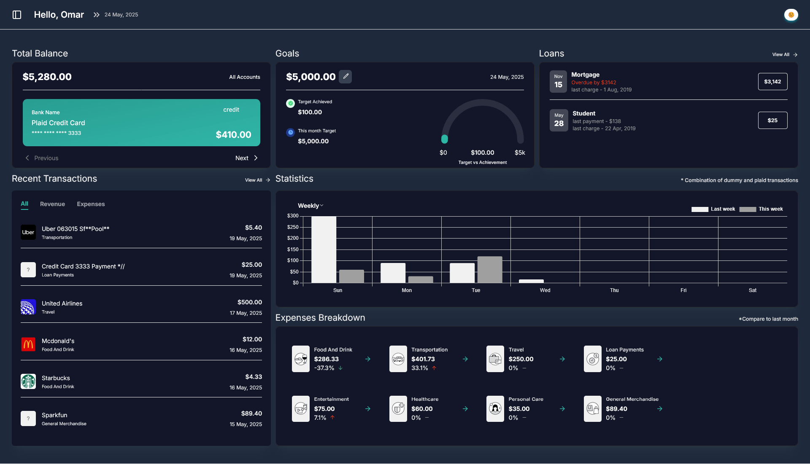
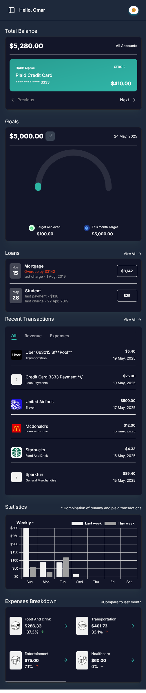

# **Finvestor – Smart Expense/Income & Loans Tracker**

> **Finvestor** is a modern **expense/income tracking and Loans app** built to help users manage their money, track loans, and grow wealth—intuitively and securely.

---

## **📸 Screenshots**

| **Dashboard View**                        | **Mobile View**                               |
| ----------------------------------------- | --------------------------------------------- |
|  |  |

---

## **🚀 Live Demo**

🔗 **[Visit Finvestor Live](https://finvestor.vercel.app)**

---

## **🛠️ Tech Stack**

### **Frontend**

* **Next.js 15** (App Router)
* **React 18+** (Hooks, Server Components)
* **TypeScript** (Static Typing)
* **Tailwind CSS** (Utility-First Styling)
* **React Hook Form + Zod** (Form Handling & Validation)
* **Chart.js** (Data Visualization)
* **next-themes** (Dark/Light Mode Toggle)

### **Backend**

* **MongoDB + Mongoose**
* **Prisma** (Data Modeling)
* **NextAuth (Credentials Provider)**
* **Plaid API** (Bank Integration)

---

## **🔒 Features**

* ✅ **Dark / Light Mode Support**
* ✅ **Bank Connection via Plaid**
* ✅ **Expense + Income Tracking**
* ✅ **Loans Tracking**
* ✅ **Graph Reports & Visualization**
* ✅ **User Profile Management**
* ✅ **Secure API Routes**
* ✅ **JWT Auth with Refresh Tokens**
* ✅ **Form Validation with Zod**

---

## **🖥️ Installation Guide**

### 🔹 Prerequisites

* [Node.js](https://nodejs.org/)
* [Docker](https://www.docker.com/)
* [MongoDB (locally or Atlas)](https://www.mongodb.com/)

### 🔹 Clone & Setup

```bash
git clone https://github.com/ahmed-alfarouq/finvestor.git
cd finvestor
cp .env.example .env
```

### 🔹 Run

```bash
npm install

npm run dev
```

### 🔹 Run with Docker

```bash
docker-compose up --build
```

---

## **👨‍💻 Author**

🧑‍💻 **Ahmed Al-Farouq**
* GitHub: [@ahmed-alfarouq](https://github.com/ahmed-alfarouq)
* LinkedIn: [ahmed-alfarouq](https://linkedin.com/in/ahmed-alfarouq)

---

## **🤝 Contributing**

Pull requests, issues, and feature ideas are welcome!
Check the [issues page](../../issues/) for open tasks.

---

## **⭐ Show Your Support**

If you find **Finvestor** helpful, **please star the repo**! ⭐
Let’s empower financial literacy with clean, modern tools. 💰📊

---

Let me know if you want help integrating the Plaid API section into the docs.
